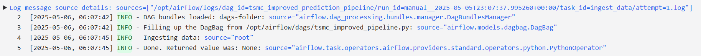
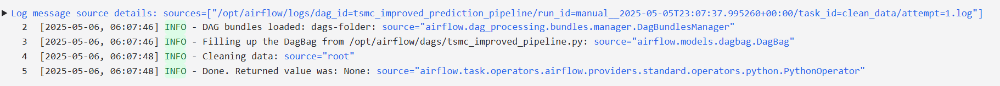
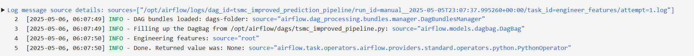
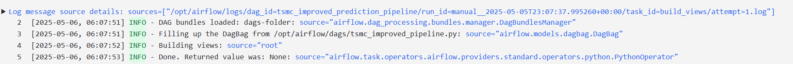
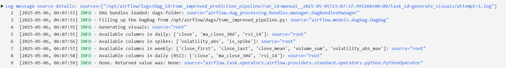
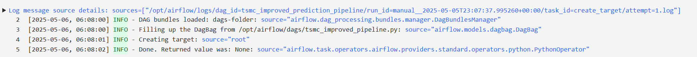
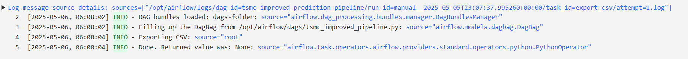

---
title: "Feature Engineering Lab"
author: "Romain BLANCHOT 67540460063" 
date: \today
geometry: "margin=1in"
fontsize: 11pt
header-includes:
  - \usepackage{amsmath}
  - \usepackage{amssymb}
  - \usepackage{graphicx}
  - \usepackage{fancyhdr}
  - \pagestyle{fancy}
  - \fancyhead[R]{Feature Engineering Lab - Romain BLANCHOT}
  - \usepackage{xcolor}
  - \definecolor{darkblue}{RGB}{0,0,139}
  - \usepackage{tcolorbox}
  - \usepackage{enumitem}
---

\begin{tcolorbox}[colback=darkblue!5!white, colframe=darkblue!75!black, title=Feature Engineering Lab]
\end{tcolorbox}

# CPE393 MLOps Lab – Feature Engineering Pipeline

## GitHub Repository

[Link to the GitHub repository](https://github.com/LeMarechalDeFer/MLOps_CPE393-FeatureEngineering) : [https://github.com/LeMarechalDeFer/MLOps_CPE393-FeatureEngineering](https://github.com/LeMarechalDeFer/MLOps_CPE393-FeatureEngineering)

## Pipeline Overview

